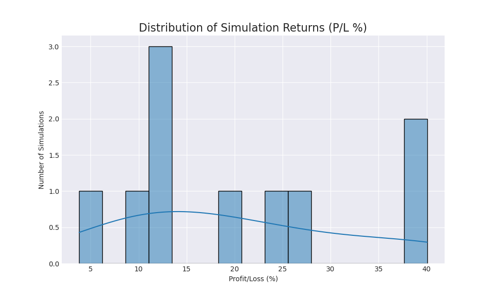
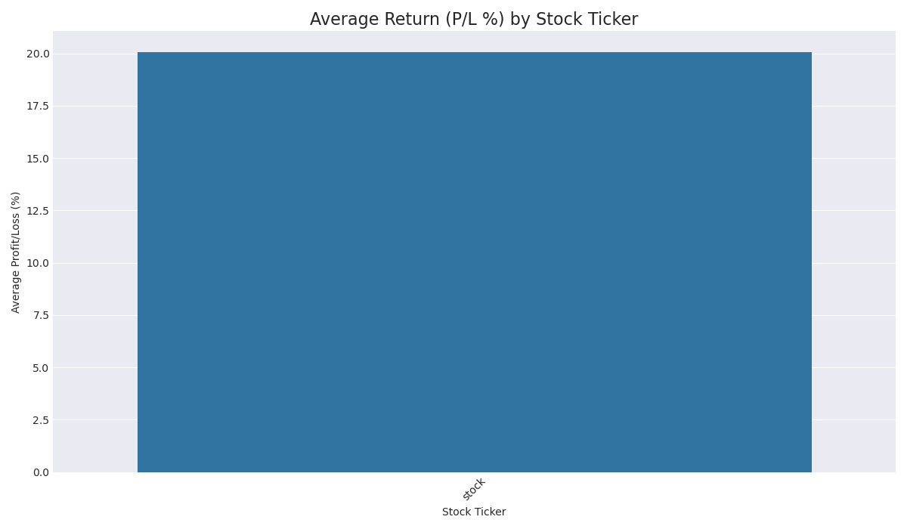
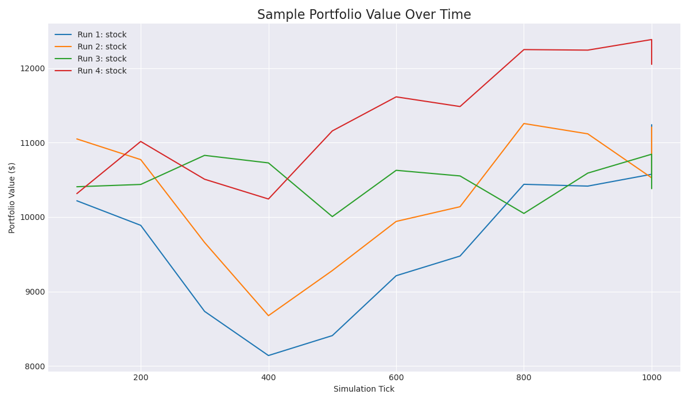

# Trading Agent Performance Report

**Date Generated:** 2025-06-19 21:04:11
**Total Simulations:** 10

## Overall Performance Metrics

- **Average Return (P/L %):** `20.06%`
- **Standard Deviation of Returns:** `12.03%`
- **Best Performing Run:** `40.06%`
- **Worst Performing Run:** `3.81%`
- **Win Rate (profitable runs):** `100.0%`
- **Average Trades per Simulation:** `133.7`

## Performance Charts

### Distribution of Returns
This chart shows the consistency of the trading agent. A tighter distribution is preferable.

### Average Return by Ticker
This chart shows on which stocks the agent performed best on average.

### Sample Portfolio Trajectories
This chart shows how the portfolio value evolved during a few sample runs.

