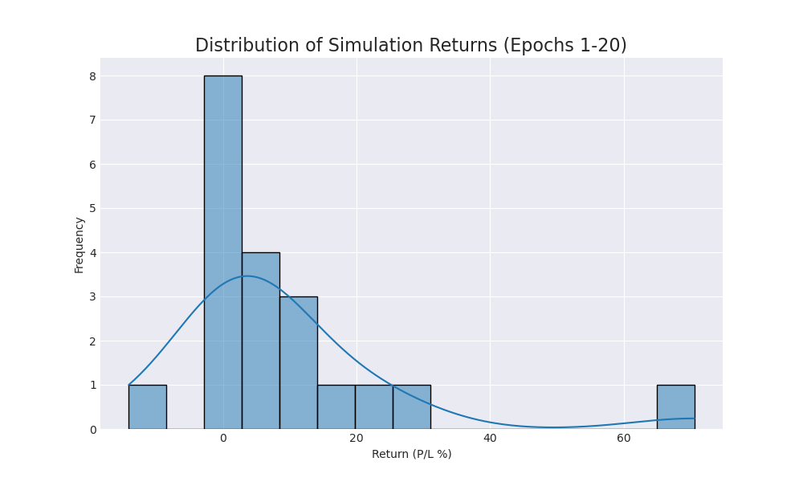
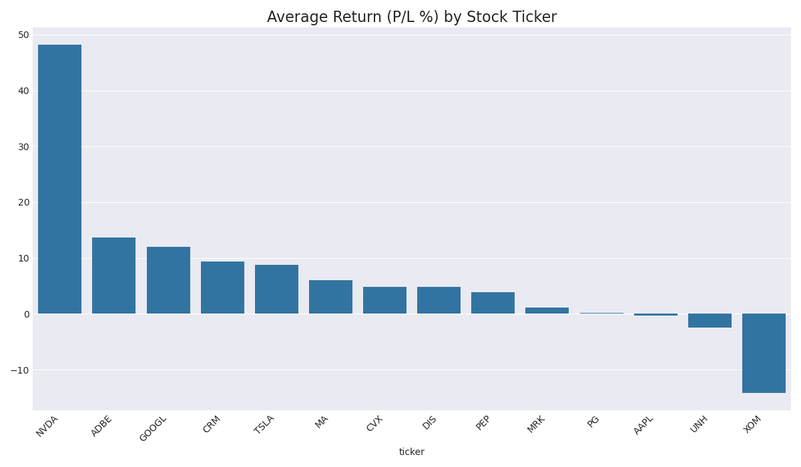

# Trading Agent Performance Report (Epoch 20)

This report summarizes agent performance over 20 simulation runs.

## Overall Performance
- **Average Return (P/L %):** `8.74%`
- **Win Rate (profitable runs):** `80.0%`

