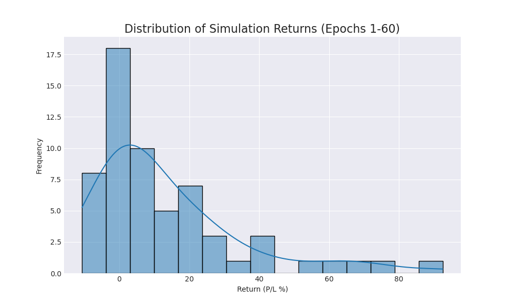
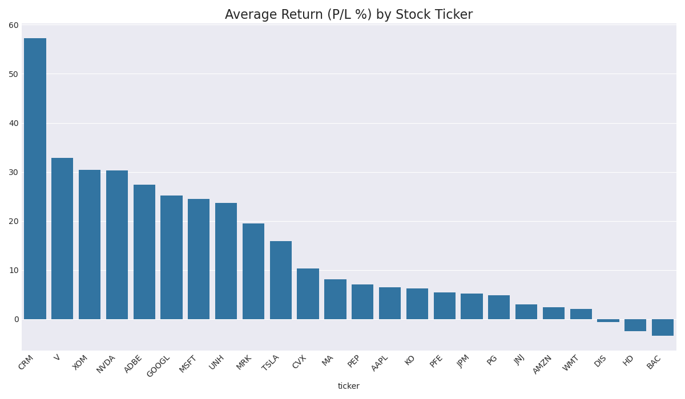

# Trading Agent Performance Report (Epoch 60)

This report summarizes agent performance over 60 simulation runs.

## Overall Performance
- **Average Return (P/L %):** `13.73%`
- **Win Rate (profitable runs):** `76.7%`

