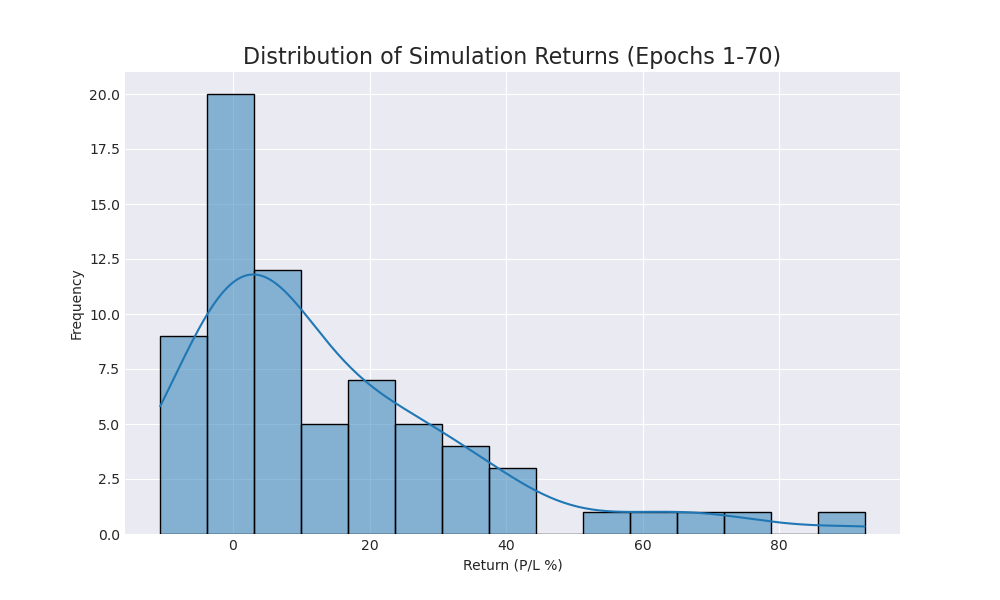
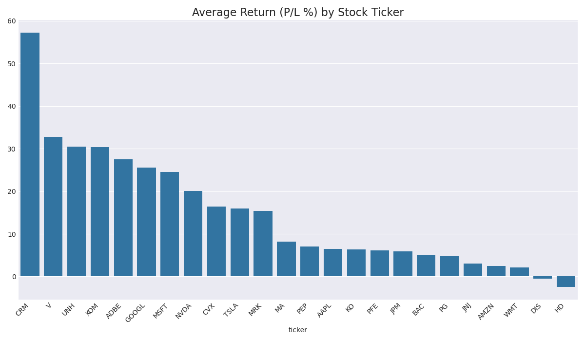

# Trading Agent Performance Report (Epoch 70)

This report summarizes agent performance over 70 simulation runs.

## Overall Performance
- **Average Return (P/L %):** `14.23%`
- **Win Rate (profitable runs):** `77.1%`

