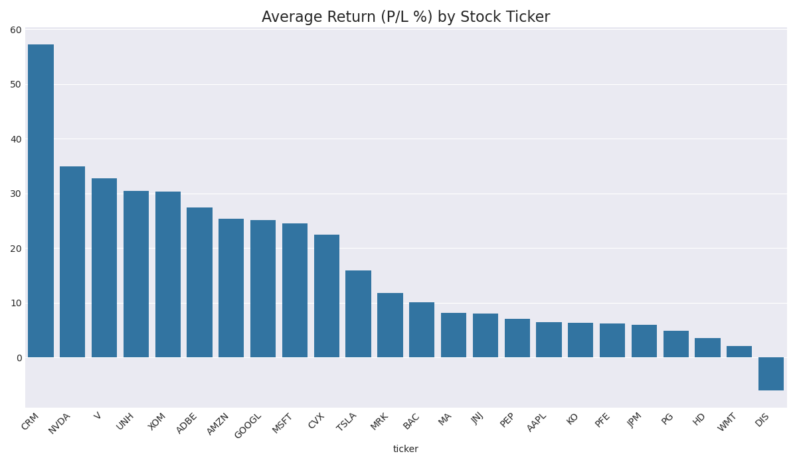

# Trading Agent Performance Report (Epoch 80)

This report summarizes agent performance over 80 simulation runs.

## Overall Performance
- **Average Return (P/L %):** `15.92%`
- **Win Rate (profitable runs):** `77.5%`

