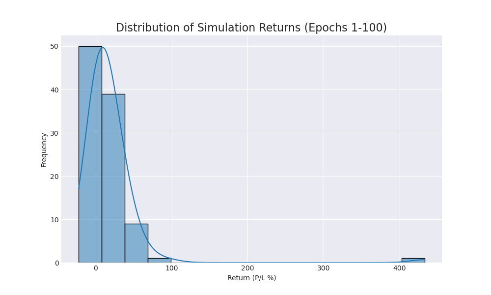
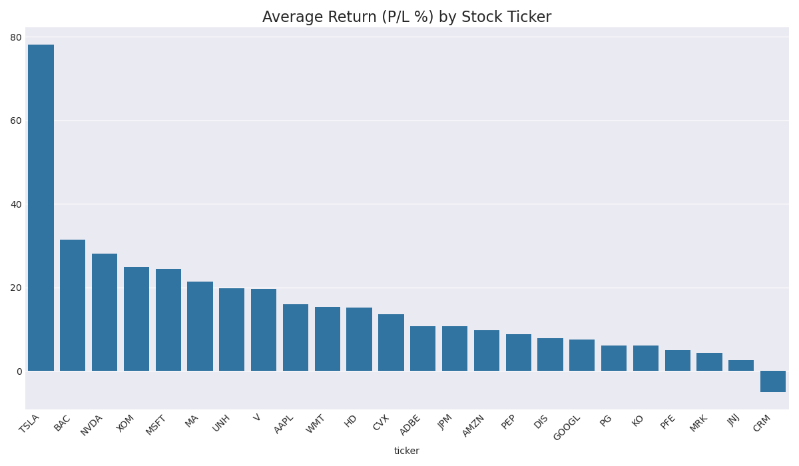

# Trading Agent Performance Report (Epoch 100)

This report summarizes agent performance over 100 simulation runs.

## Overall Performance
- **Average Return (P/L %):** `18.30%`
- **Win Rate (profitable runs):** `84.0%`

