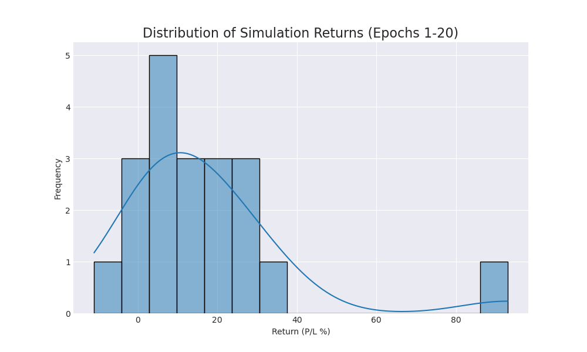
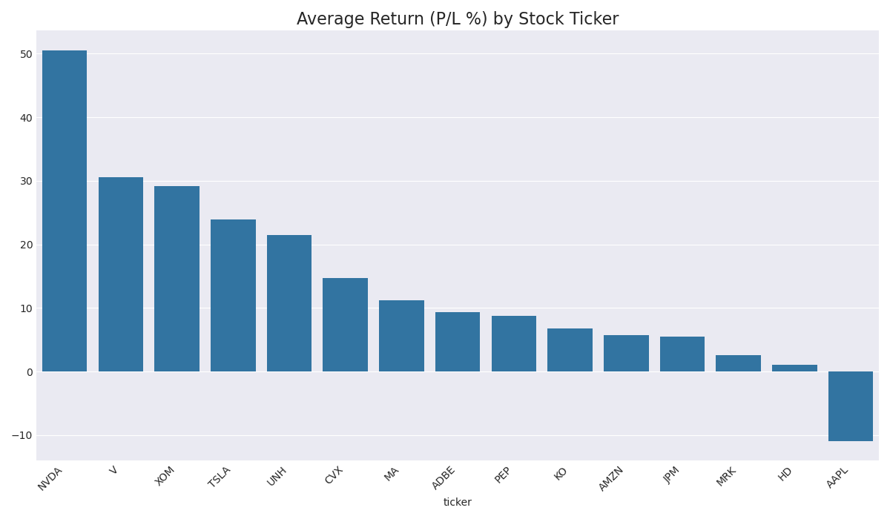

# Trading Agent Performance Report (Epoch 20)

This report summarizes agent performance over 20 simulation runs.

## Overall Performance
- **Average Return (P/L %):** `16.82%`
- **Win Rate (profitable runs):** `95.0%`

