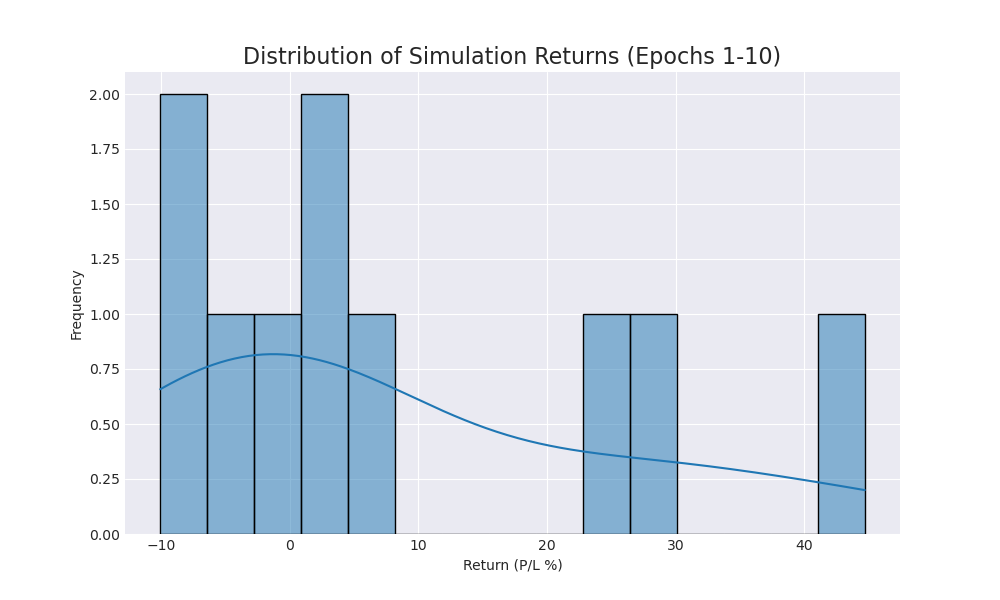
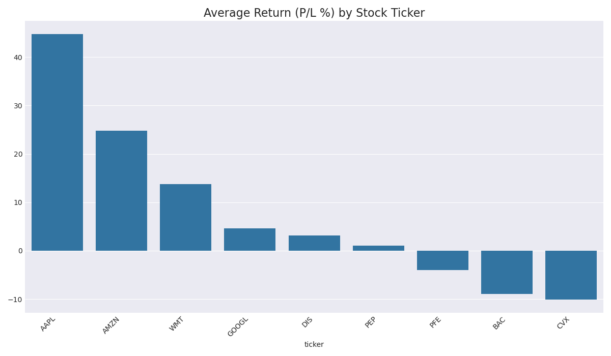

# Trading Agent Performance Report (Epoch 10)

This report summarizes agent performance over 10 simulation runs.

## Overall Performance
- **Average Return (P/L %):** `8.28%`
- **Win Rate (profitable runs):** `60.0%`

