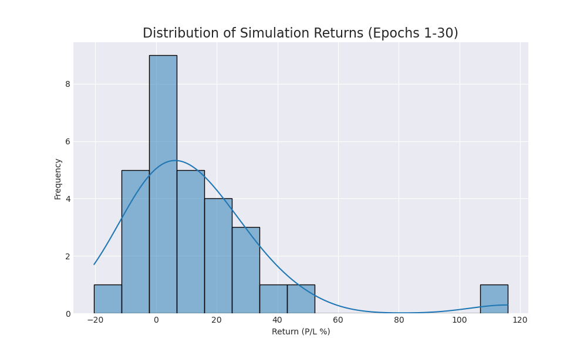
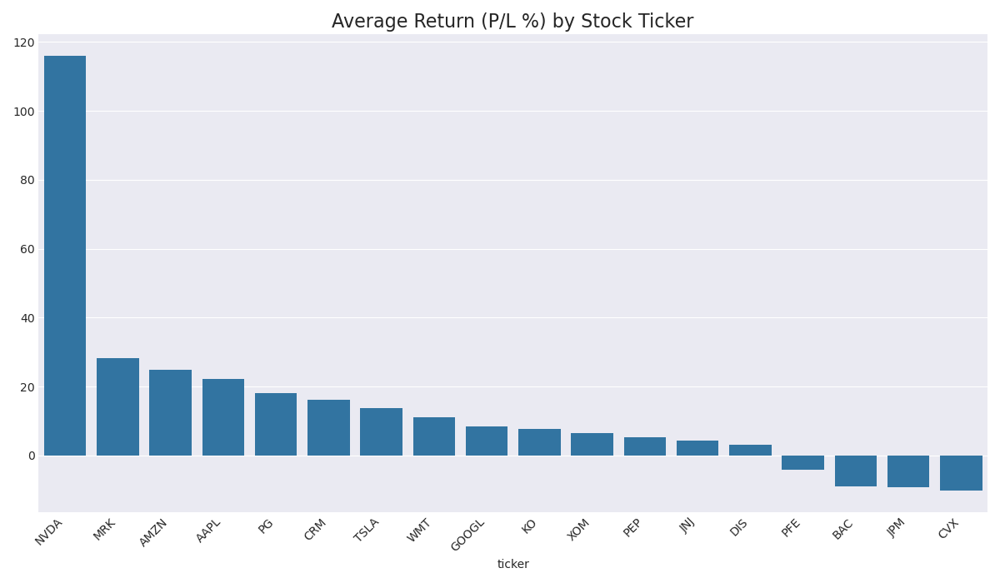

# Trading Agent Performance Report (Epoch 30)

This report summarizes agent performance over 30 simulation runs.

## Overall Performance
- **Average Return (P/L %):** `13.20%`
- **Win Rate (profitable runs):** `70.0%`

