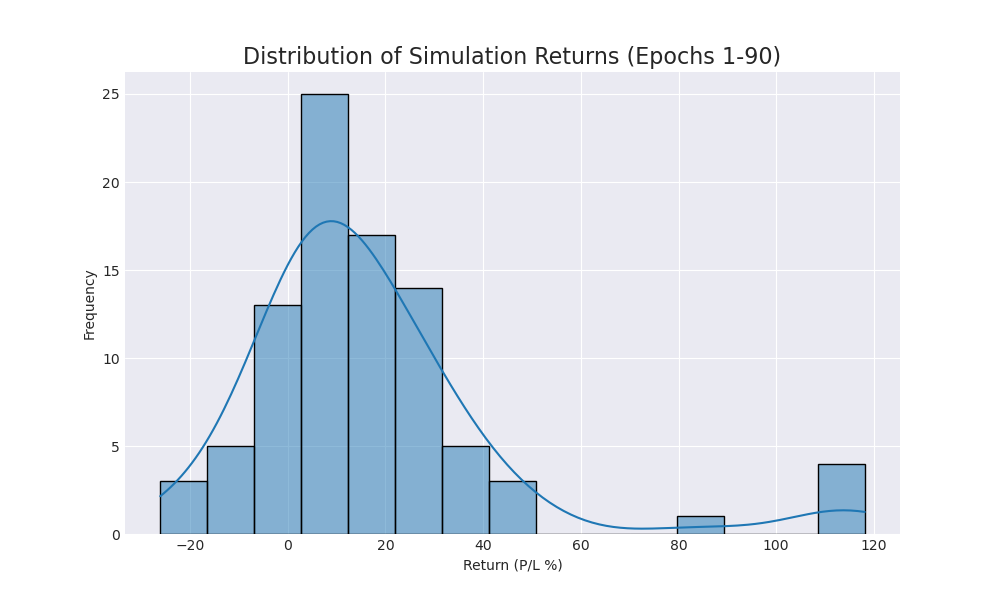
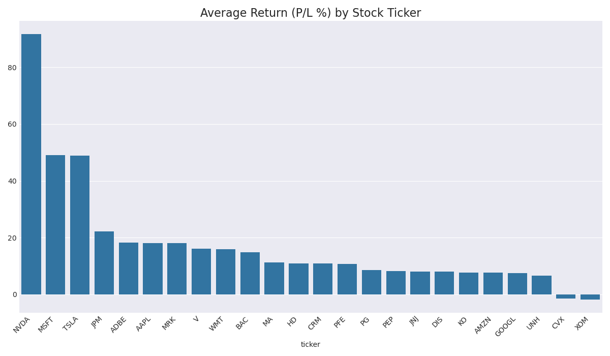

# Trading Agent Performance Report (Epoch 90)

This report summarizes agent performance over 90 simulation runs.

## Overall Performance
- **Average Return (P/L %):** `17.14%`
- **Win Rate (profitable runs):** `81.1%`

