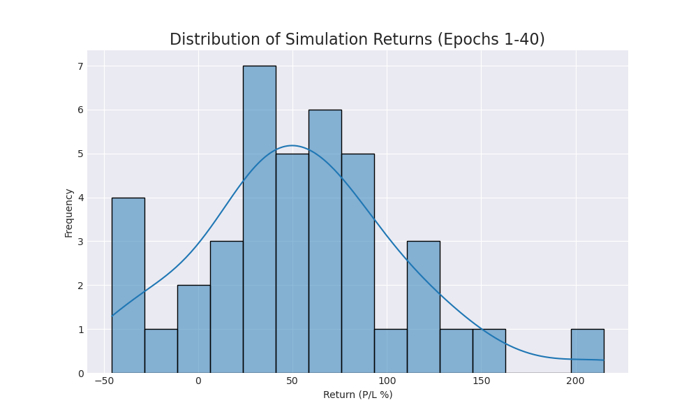
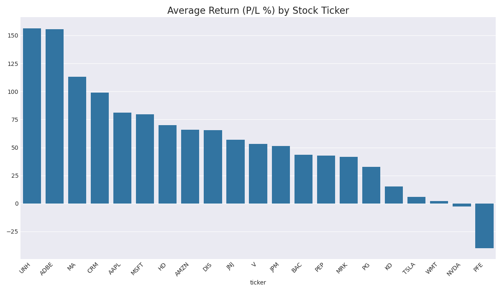

# Trading Agent Performance Report (Epoch 40)

This report summarizes agent performance over 40 simulation runs.

## Overall Performance
- **Average Return (P/L %):** `53.97%`
- **Win Rate (profitable runs):** `85.0%`

