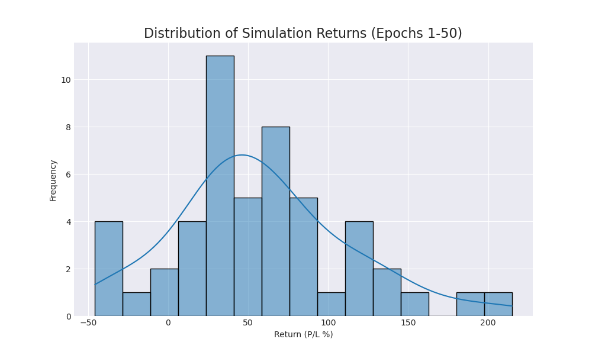
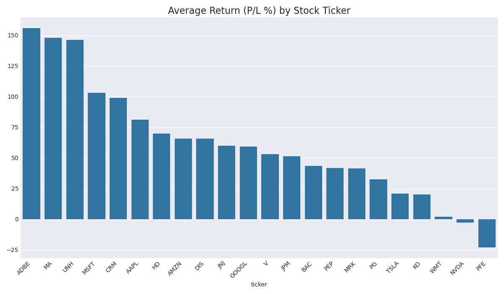

# Trading Agent Performance Report (Epoch 50)

This report summarizes agent performance over 50 simulation runs.

## Overall Performance
- **Average Return (P/L %):** `57.74%`
- **Win Rate (profitable runs):** `88.0%`

