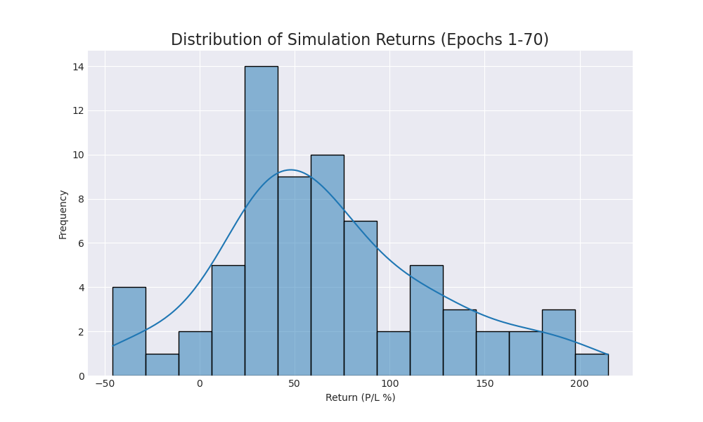
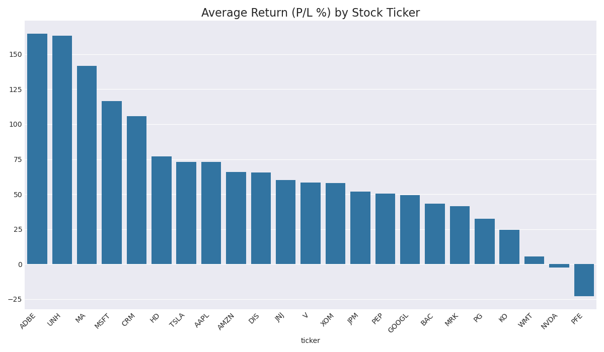

# Trading Agent Performance Report (Epoch 70)

This report summarizes agent performance over 70 simulation runs.

## Overall Performance
- **Average Return (P/L %):** `68.26%`
- **Win Rate (profitable runs):** `91.4%`

